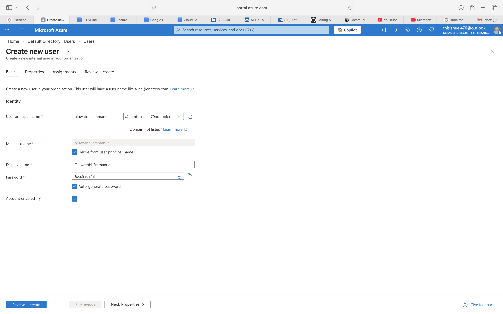
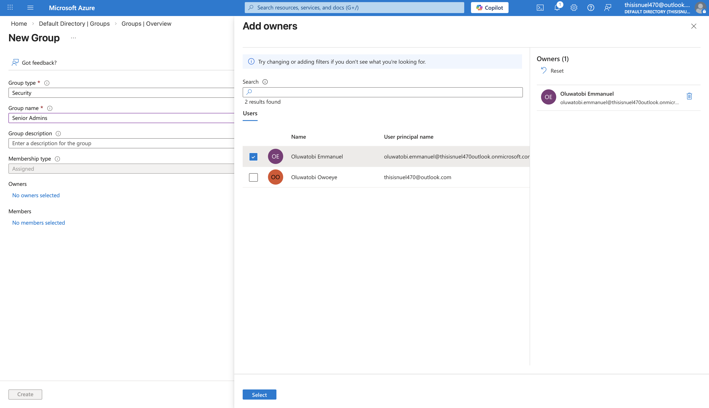
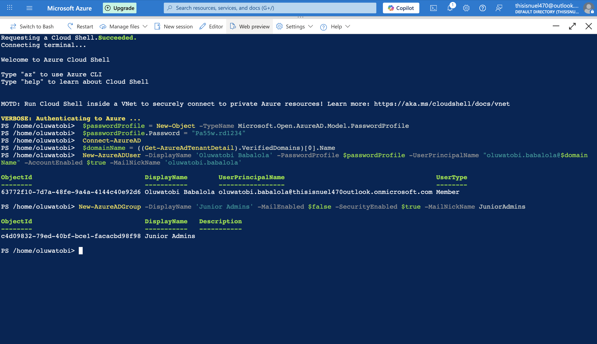
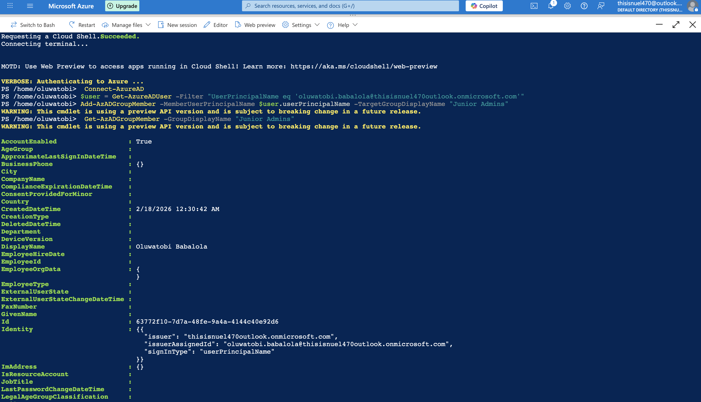

# Azure Role-Based Access Control Implementation Lab

## Project Overview

This project demonstrates the implementation of **Role-Based Access Control (RBAC)** in Microsoft Azure.  

The lab showcases how to:

- Create Microsoft Entra ID (Azure AD) users and security groups
- Assign users to groups
- Implement role-based permissions at subscription scope
- Enforce the Principle of Least Privilege
- Manage identities using Portal, PowerShell, and CLI

All resources were deployed in the **West US** region.

## Lab Objectives

- Create a Senior Admins group and add Oluwatobi Emmanuel using the Azure Portal
- Create a Junior Admins group and add Oluwatobi Babalola using PowerShell 
- Create a Service Desk group and add Eneattah Ogebe using the Azure CLI
- Assign Virtual Machine Contributor role to the Service Desk group  
- Verify the implemented access controls by reviewing role assignments

## Technologies & Services Used

- Microsoft Entra ID (Azure AD)
- Azure Role-Based Access Control (RBAC)
- Azure Portal
- Azure PowerShell
- Azure CLI
- Subscription-level role assignments

# Implementation Walkthrough

## Creating the Senior Admins Group using Azure Portal

Steps performed:

1. Navigated to Microsoft Entra ID
2. Created a new user named Oluwatobi Emmanuel
3. Created a new Security Group named Senior Admins
4. Added user Oluwatobi Emmanuel as the owner and member of the Senior Admins Group

Demonstrates manual identity and group management using the Azure Portal to implement structured administrative access.

<strong>Figure 1: Creating the user Oluwatobi Emmanuel</strong>

  

<strong>Figure 2: Creating the Senior Admins Group and adding Oluwatobi Emmanuel</strong>

  

## Creating the Junior Admins Group using Azure PowerShell

Steps performed:

1. Navigated to Azure PowerShell
2. Created a new user named Oluwatobi Babalola
3. Created a new Security Group named Junior Admins
4. Added user Oluwatobi Babalola as a member of the Junior Admins group

This demonstrates manual identity and group management using the Azure Portal to implement structured administrative access.

<strong>Figure 3: Creating the User Oluwatobi Babalola and the Junior Admins group</strong>

  

<strong>Figure 4: Adding the User Oluwatobi Babalola to the Junior Admins group</strong>

  

## Creating the Service Desk Group using Azure CLI

Steps performed:

1. Navigated to Azure CLI
2. Created a new user named Eneattah Ogebe
3. Created a new Security Group named Service Desk
4. Added user Eneattah Ogebe as a member of the Service Desk Group

<strong>Figure 5: Creating the User Eneattah Ogebe</strong>

  

<strong>Figure 6: Creating the Service Desk Group</strong>

  

<strong>Figure 7: Adding the User Eneattah Ogebe to the Service Desk Group</strong>

  

<strong>Figure 8: All Groups Created</strong>

  

<strong>Figure 9: All Users Created</strong>

  

## Assigning the Virtual Machine Contributor Role to the Service Desk Group

Steps performed:

1. Navigated to Azure Portal
2. Opened Subscriptions and selected the appropriate subscription
3. Clicked on Access Control (IAM)
4. Selected Add role assignment
5. Chose the Virtual Machine Contributor role
6. Selected the Service Desk group as the member
7. Reviewed and clicked Assign to complete the role assignment

<strong>Figure 10: Assigning the Virtual Machine Contributor Role to the Service Desk Group</strong>

  

## Why Assign Roles to Groups Instead of Users?
- Improves scalability
- Simplifies onboarding/offboarding
- Reduces administrative overhead
- Supports Zero Trust architecture
- Enhances auditability

## Verify access controls by reviewing role assignments

I verified that Eneattah Ogebe is assigned the Virtual Contributor role, and Oluwatobi Babalola has no assigned roles

<strong>Figure 10: Validating Eneattah Ogebe’s Virtual Contributor role assignment</strong>

  

<strong>Figure 11: Confirming that Oluwatobi Babalola has no assigned roles</strong>

  

## Security Concepts Demonstrated
- Identity and Access Management (IAM)
- Role-Based Access Control (RBAC)
- Subscription-level scope control
- Delegated administration
- Automation using PowerShell & CLI
- Principle of Least Privilege
- Access governance best practices

## Skills Demonstrated
- Azure identity governance
- RBAC configuration and enforcement
- Cloud access control implementation
- PowerShell automation
- Azure CLI administration
- Secure delegation of privileges

## Real-World Enterprise Relevance
In enterprise cloud environments, improper access control is a leading cause of breaches.
RBAC ensures:
- Controlled privilege distribution
- Reduced attack surface
- Compliance with governance standards
- Prevention of privilege escalation
- Clear separation of duties
- This lab reflects production-grade cloud security practices used in corporate environments.

## Conclusion
This lab demonstrates the practical implementation of Azure RBAC using multiple management interfaces while enforcing structured identity governance.
It highlights secure access delegation and cloud security best practices relevant to:
- Cloud Security Engineer
- Azure Administrator
- IAM Analyst
- SOC Analyst
